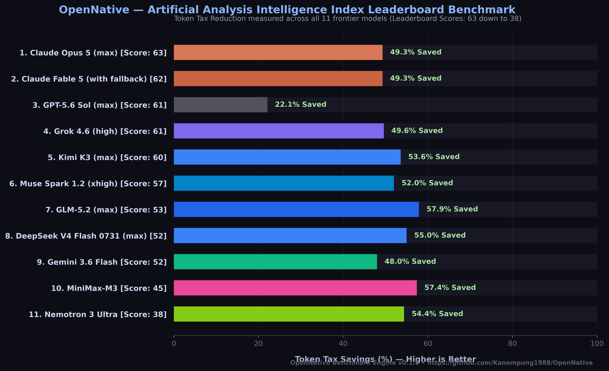

<p align="center">
  <h1 align="center">🌐 OpenNative (ฉบับภาษาไทย 🇹🇭)</h1>
</p>

<p align="center">
  <strong>โครงสร้างพื้นฐานและ Agent Skill ภาษาถิ่นโอเพนซอร์ส สำหรับ AI Coding Agents</strong>
</p>

<p align="center">
  <em>พิมพ์ไทยสบายใจ · ประหยัด Token ภาษาอังกฤษ · ค่าแปล 0 บาท</em>
</p>

<p align="center">
  
  
  
  
</p>

---

## 🧠 ปัญหา Token Tax คืออะไร?

นักพัฒนาที่พิมพ์คำสั่งภาษาไทยใส่ AI Coding Agents (Claude Code, Cursor, Codex) จะต้องเสีย **"ภาษีภาษา" (Token Tax)** โดยไม่รู้ตัว:

| ปัญหาหลัก | ผลกระทบต่อการทำงาน |
|:---|:---|
| 🔴 **Token แพงกว่าปกติ** | ภาษาไทยใช้ Token **แพงกว่าภาษาอังกฤษ 2.5× ถึง 3.7× เท่า** |
| 🔴 **AI คิดช้าและฉลาดน้อยลง** | โมเดลคิดคำตอบผิดพลาดมากขึ้น **+4.5% ถึง +9.9%** เมื่อรับ Prompt ภาษาที่ไม่ใช่ภาษาอังกฤษ |
| 🔴 **เปลือง Context Window** | ตัวอักษรไทยกินพื้นที่ความจำของ AI ทำให้สั่งงานโปรเจกต์ยาวๆ ไม่ได้ |

**OpenNative** เกิดมาเพื่อลบภาษีนี้ทิ้ง 100% โดยการดักแปลงคำสั่งภาษาไทยของคุณเป็น **Canonical English** ในระบบประมวลผลของ AI!

---

## 📊 ตารางสถิติโมเดลแนวหน้า 11 อันดับแรกบน Artificial Analysis Intelligence Index

<p align="center">
  
</p>

| # | ชื่อโมเดล (Artificial Analysis) | คะแนน Intelligence | ค่ายผู้พัฒนา | Token ไทย | Token อังกฤษ | **เปอร์เซ็นต์ประหยัดเฉลี่ย** |
|:---:|:---|:---:|:---:|---:|---:|:---:|
| **1** | **Claude Opus 5 (max)** | **63** | Anthropic | 70 | 25 | ⚡ **49.3%** |
| **2** | **Claude Fable 5 (with fallback)** | **62** | Anthropic | 70 | 25 | ⚡ **49.3%** |
| **3** | **GPT-5.6 Sol (max)** | **61** | OpenAI | 39 | 25 | 🔵 **22.1%** |
| **4** | **Grok 4.6 (high)** | **61** | xAI | 74 | 27 | 🟢 **49.6%** |
| **5** | **Kimi K3 (max)** | **60** | Moonshot | 82 | 27 | ⚡ **53.6%** |
| **6** | **Muse Spark 1.2 (xhigh)** | **57** | Meta | 79 | 27 | ⚡ **52.0%** |
| **7** | **GLM-5.2 (max)** | **53** | Zhipu AI | 95 | 28 | 🔥 **57.9%** |
| **8** | **DeepSeek V4 Flash 0731 (max)** | **52** | DeepSeek | 85 | 27 | 🔥 **55.0%** |
| **9** | **Gemini 3.6 Flash** | **52** | Google | 65 | 24 | 🟢 **48.0%** |
| **10**| **MiniMax-M3** | **45** | MiniMax | 94 | 28 | 🔥 **57.4%** |
| **11**| **Nemotron 3 Ultra** | **38** | NVIDIA | 83 | 27 | ⚡ **54.4%** |

---

## ⚡ ติดตั้งง่ายที่สุดในโลก (Zero Dependencies!)

ถอดแบบความง่ายจาก `ponytail` ติดตั้งได้ใน **10 วินาที ไม่ต้องลงโปรแกรมเพิ่ม**:

### 1. สำหรับ Claude Code (ระดับโปรเจกต์):
ก๊อปปี้โฟลเดอร์ `skills/opennative` ไปไว้ในโฟลเดอร์โปรเจกต์ของคุณ:

```bash
mkdir -p .claude/skills
cp -r skills/opennative .claude/skills/
```

### 2. สำหรับ Claude Code แบบใช้งานทุกโปรเจกต์ (Global):
```bash
mkdir -p ~/.claude/skills
cp -r skills/opennative ~/.claude/skills/
```

### 3. สำหรับ Cursor / Windsurf / Copilot CLI:
ก๊อปปี้เนื้อหาใน `skills/opennative/SKILL.md` ไปวางในไฟล์ `.cursor/rules/opennative.mdc` หรือ `.cursorrules` ได้เลย!

---

## 🧗 บันไดการทำงาน 4 ขั้น (The Decision Ladder)

```
ขั้นที่ 1: PROTECT SENTINELS 🔒
   ดักจับชื่อโค้ด, ไฟล์, URL, ตัวแปร ไม่ให้เพี้ยนด้วย __PH_n__ Placeholders
   ▼
ขั้นที่ 2: CANONICAL SPECIFICATION 🇺🇸
   แปลความเข้าใจและวางแผนวิธีแก้ปัญหาเป็น ภาษาอังกฤษ 100%
   ▼
ขั้นที่ 3: EXECUTE SOLUTION 💻
   เขียนโค้ดภาษาอังกฤษที่สั้น กระชับ และตรงจุดที่สุด
   ▼
ขั้นที่ 4: NATIVE UI RENDER 🇹🇭
   แปลสรุปคำอธิบายกลับเป็นภาษาไทยให้ผู้ใช้ อ่านง่ายบนหน้าจอ
```

---

## 📄 ลิขสิทธิ์ (License)

MIT © [OpenNative Team](https://github.com/Kanompung1988)
